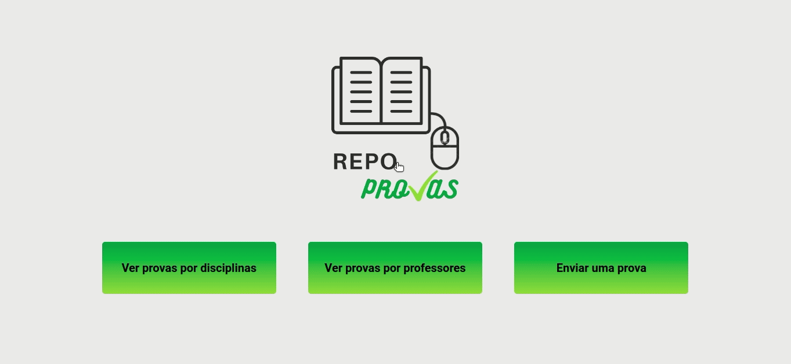

# Repoprovas

In Repoprovas people can share the tests they have anonymously.



Try it out now at http://repoprovas-front-one.vercel.app

## About

This is an web application where it is possible to view old tests separated by professor or subject and also send tests. Below are the implemented features:

- Send a test
- See the test by subjects
- See the tests by teachers

By using this app any user can improve their studies through targeted practice.

## Technologies
The following tools and frameworks were used in the construction of the project:<br>
<p>
    
    
    
    
    
    
    
</p>

## How to run

1. Clone this repository
2. Clone the back-end repository at https://github.com/thipereira02/Repoprovas_Back and follow the instructions to run
3. Install dependencies
```bash
npm i
```
4. Run with
```bash
npm start
```
5. You can optionally build the project running
```bash
npm run build
```
6. Finally access http://localhost:3000 on your favorite browser (unless it is Internet Explorer)
